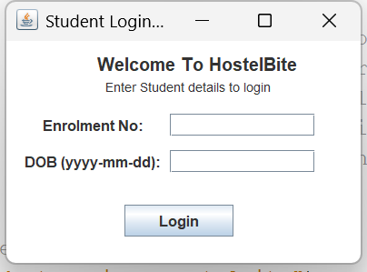
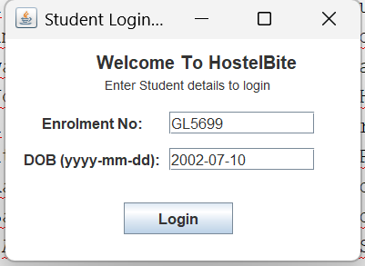
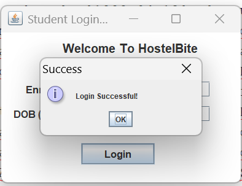
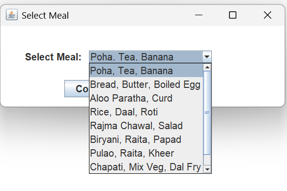
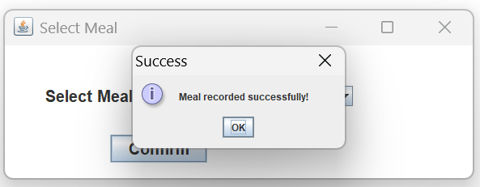
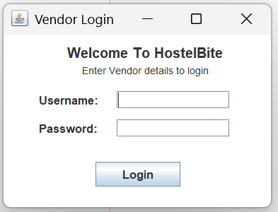
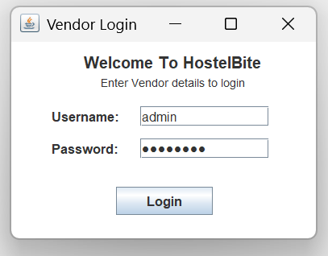
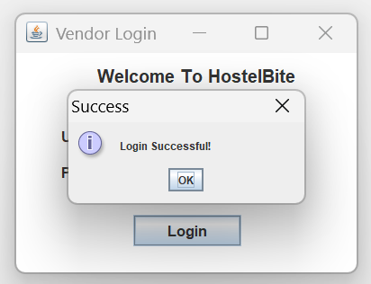
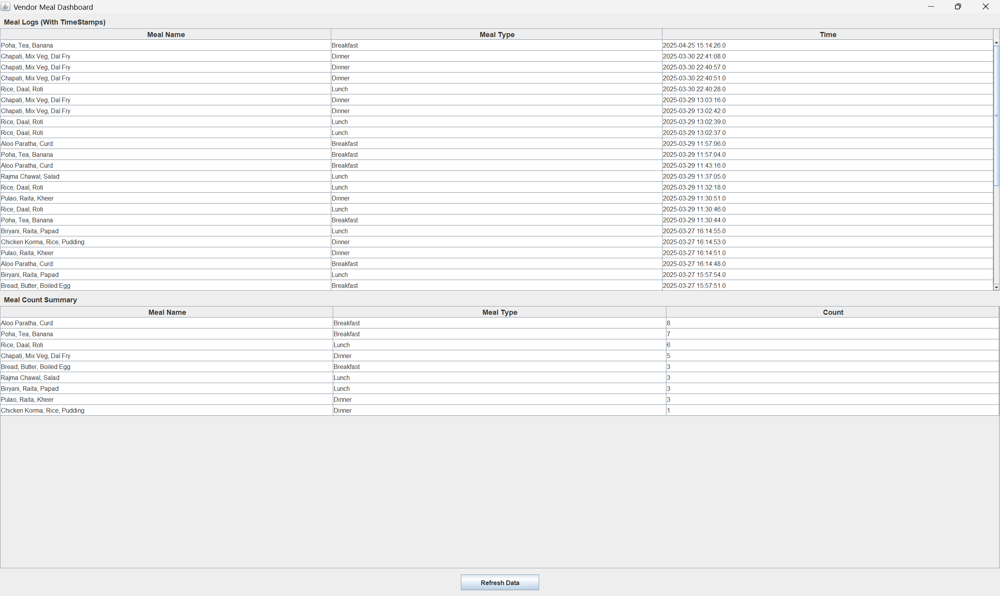

# hostelbite
Java Swing Based Application For CAMS-2001 - Object Oriented Programming Using Java
 Tech Stack --> Java, Swing, JDBC, MySQL

Requirements-->
To create a Java Swing GUI based application to resemble the below problem statement:

"A client-sever based Hostel Mess Management System using Java. In the 
system, a particular student would visit the hostel mess and request for a meal using 
his/her ID card and the system installed at the mess will read their Hall Ticket and a 
counter would be incremented at server end. And now the student is allowed to take 
his/her food. Using this counter, the hostel mess vendor can analyze the total 
number of students who have taken food at a particular time and the total count of each food item picked." 

